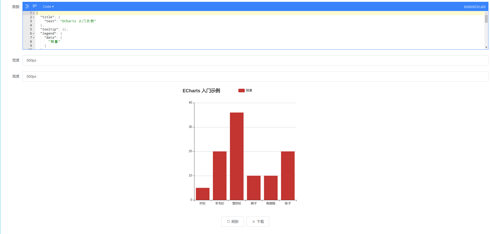

# echarts-study

echarts 学习工具

## 运行方式

```bash
yarn run serve
```

或直接打开在线网址:

[https://tanghuibo.github.io/echarts-study](https://tanghuibo.github.io/echarts-study)

## 界面



填好 eachrts 数据，动态刷新界面，并可将生成的图表下载成 png 或 jpg 。
